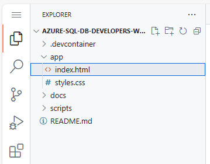
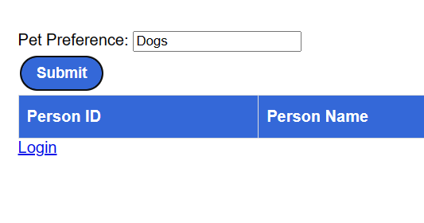
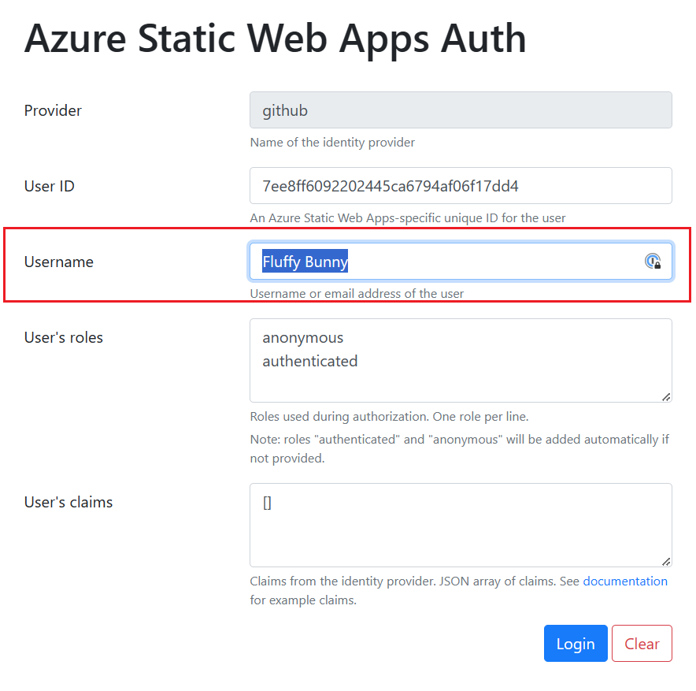
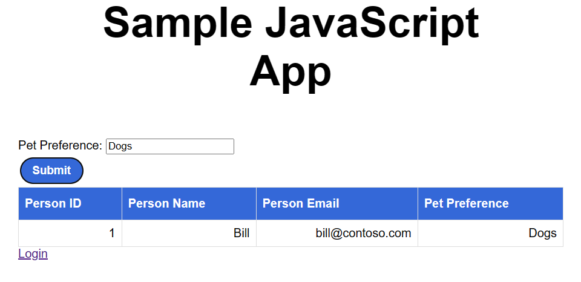

# Static Web Apps CLI

## What is Azure Static Web Apps?

Azure Static Web Apps is a service that automatically builds and deploys full stack web apps to Azure from a code repository or can be used locally using SWA CLI. The workflow of Azure Static Web Apps is tailored to a developer's daily workflow; apps are built and deployed based on code changes to the repository for a complete CI/CD experience. When you create an Azure Static Web Apps resource, Azure interacts directly with GitHub or Azure DevOps, to monitor a branch of your choice. Every time you push commits or accept pull requests into the watched branch, a build automatically runs and your app and API deploys to Azure.


Static web apps are commonly built using libraries and web frameworks like Angular, React, Svelte, Vue, or Blazor where server side rendering isn't required. These apps include HTML, CSS, JavaScript, and image assets that make up the application. With a traditional web server, these assets are served from a single server alongside any required API endpoints.

With Static Web Apps, static assets are separated from a traditional web server and are instead served from points geographically distributed around the world. This distribution makes serving files much faster as files are physically closer to end users. In addition, API endpoints are hosted using a serverless architecture, which avoids the need for a full back-end server altogether.

### SWA CLI

The Static Web Apps CLI, also known as SWA CLI, serves as a local development tool for Azure Static Web Apps. It can:

* Serve static app assets, or proxy to your app dev server
* Serve API requests, or proxy to APIs running in Azure Functions Core Tools
* Emulate authentication and authorization
* Emulate Static Web Apps configuration, including routing and ACL roles
* Deploy your app to Azure Static Web Apps

This workshop will use SWA CLI for Data API builder and authentication.

### How SWA works locally


**Requests** made to port 4280 are forwarded to the appropriate server depending on the type of request.

**Static content** requests, such as HTML or CSS, are either handled by the internal CLI static content server, or by the front-end framework server for debugging.

**Authentication and authorization** requests are handled by an emulator, which provides a fake identity profile to your app.

**Functions Core Tools runtime** handles requests to the site's API.

**Responses** from all services are returned to the browser as if they were all a single application.

## SWA CLI workshop tasks

The following tasks will show you how to integrate a local Static Web Apps environment right in the codespace.

Static Web Apps has built in [integration with the Azure SQL Database/Local SQL Server (and other Azure Databases)](https://learn.microsoft.com/en-us/azure/static-web-apps/database-overview). SWA CLI uses a config file located in the swa-db-connections directory. Seeing Static Web Apps utilizes Data API builder, we can just copy the dab-config.json file right into that directory and have all the entities we added just work on startup.

1. Start by creating a directory called swa-db-connections in the top level directory. Use the following commands:

    Be at the top level directory for the project

    ```bash
    cd /workspaces/azure-sql-db-developers-workshop
    ```

    Now, create the directory

    ```bash
    mkdir swa-db-connections
    ```

1. As was stated before, we can use the dab-config.json file for Static Web Apps database connections. Use the following command to copy the Data API builder config file into the newly created directory for Static Web Apps. The file will be named staticwebapp.database.config.json

    ```bash
    cp dab-config.json ./swa-db-connections/staticwebapp.database.config.json
    ```

1. Next, we need to initialize the Static Web Apps environment.

    ```bash
    swa init
    ```

    Accept the **default** for the swa init question and answer "? Choose a configuration name: › azure-sql-db-developers-workshop". Press enter/return to accept the default.

    For the next question, "? Are these settings correct? › (Y/n)", **enter Y**.
    
1. Start Static Web Apps in your codespace. The following command indicates that our app location is at /app and the database connections are located in the swa-db-connections directory.

    ```bash
    swa start --app-location ./app --data-api-location ./swa-db-connections
    ```
 
1. Once Static Web Apps has started, you will get a message in the codespace on the bottom right indicating that it's running on port 4280.

    

1. Click the **Open in Browser** green button to access the sample application in the same dialog box

    

1. The sample JavaScript application uses Static Web Apps for the HTML and CSS files as well as uses the built in Data API builder integration for all the REST calls. 

    

    Give the application a try by **entering Cats into the Pet Preference** field and **clicking Submit**.

    

    This uses the stored procedure that was REST enabled in the previous chapter.

1. Back in the codespace, open the index.html file located in the app directory and click on it.

    

1. Looking at this file in the editor, first there is a call to the Static Web Apps authentication service at /.auth/me

    ```javascript
    fetch('/.auth/me')
      .then(res => {
        return res.json()
      })
      .then(payload => {
        const { clientPrincipal } = payload;
        this.userDetails = clientPrincipal?.userDetails;
        this.userId = clientPrincipal?.userId;
      });
    ```

    Calling this endpoint after logging in will return a JSON object with user information that can be used for authentication and authorization using mock credentials. Here is an example of that JSON object.

    ```JSON
    {
        "clientPrincipal": {
            "userId": "7a60dbe0d0935cc300bb85ed47e27441",
            "userRoles": [
                "anonymous",
                "authenticated"
            ],
            "claims": [],
            "identityProvider": "github",
            "userDetails": "Brian"
        }
    }
    ```

    Next in the index.html file is a simple JavaScript fetch to the REST endpoint that was made on the person table. Once it gets the data from the REST endpoint, it loops through the rows and creates the HTML table seen on the page.

    ```javascript
    fetch('/data-api/api/person')
        .then(res => res.text())
        .then((out) => {
          let jsonData = JSON.parse(out);
          for (let i = 0; i < jsonData.value.length; i++) {
            let person = jsonData.value[i];
            peopleData.innerHTML +=
              "<tr align='right'><td>" + person.person_id + "</td>" +
              "<td>" + person.person_name + "</td>" +
              "<td>" + person.person_email + "</td>" +
              "<td>" + person.pet_preference + "</td></tr>";
          };
        })
    ```

    To note, this initial calling of the person endpoint and the call to get the authentication object occurs on page load.

    The next section of JavaScript in the index.html file is a function. This function is called when the Submit button is pressed and passes the text you enter into the Pet Preference text field to the REST enabled stored procedure that replaces the HTML table with a new one based on the result of the REST response.

    ```javascript
      function getPref(ppref) {
        fetch('/data-api/api/getPersonByPet?pet=' + ppref)
        .then(res => {
          if (res.status== '403') {
            alert('403 - forbidden, try logging in')
          }
            return res.text()}
          )    
        .then((out) => {
          peopleData.innerHTML = "";
          let jsonData = JSON.parse(out);
          for (let i = 0; i < jsonData.value.length; i++) {
            let person = jsonData.value[i];
            peopleData.innerHTML +=
              "<tr align='right'><td>" + person.person_id + "</td>" +
              "<td>" + person.person_name + "</td>" +
              "<td>" + person.person_email + "</td>" +
              "<td>" + person.pet_preference + "</td></tr>";
          };
        })
      }
    ```

    You may notice that we catch 403 HTTP Status codes. This will be used in the next section.

1. Open the staticwebapp.database.config.json in the swa-db-connections directory in the code editor by clicking on it.

    

1. Scroll down in the code editor to find the getPersonByPet section.


    ```JSON
    "getPersonByPet": {
      "source": {
        "type": "stored-procedure",
        "object": "dbo.get_person_by_pet",
        "parameters": {
          "pet": ""
        }
      },
      "permissions": [
        {
          "role": "anonymous",
          "actions": [
            "execute"
          ]
        }
      ],
      "rest": {
        "methods": [
          "get"
        ]
      },
      "graphql": {
        "operation": "query"
      }
    }
    ```

1. In the permissions section, change the role from **anonymous**

    ```JSON
      "permissions": [
        {
          "role": "anonymous",
          "actions": [
            "execute"
          ]
        }
      ],
    ```

    to **authenticated**

    ```JSON
      "permissions": [
        {
          "role": "authenticated",
          "actions": [
            "execute"
          ]
        }
      ],
    ```

    and save the file.

1. Stop SWA CLI in the terminal in the codespace with a Ctrl-C.

    Then restart with the command:

    ```bash
    swa start --app-location ./app --data-api-location ./swa-db-connections
    ```

1. Back in the browser where the sample application is, reload the page. Now, enter Dogs into the Pet Preference text field and click submit.

    

    A browser pop-up will appear indicating a 403 status error and suggesting you log into the application.

    

1. Close the dialog and click the login link on the bottom of the application

    

1. On the Azure Static Web Apps Auth page, give yourself a username in the Username text field.

    

1. Click the Login button on the bottom right of the page.

    

    This will take you back to the sample application.

1. In the sample application, again, enter Dogs into the Pet Preference text field and click submit. There will no longer be a 403 Status Error and the table will contain data returned by the REST enabled stored procedure.

    

1. Stop SWA CLI in the terminal in the codespace with a Ctrl-C.
