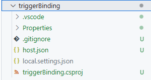
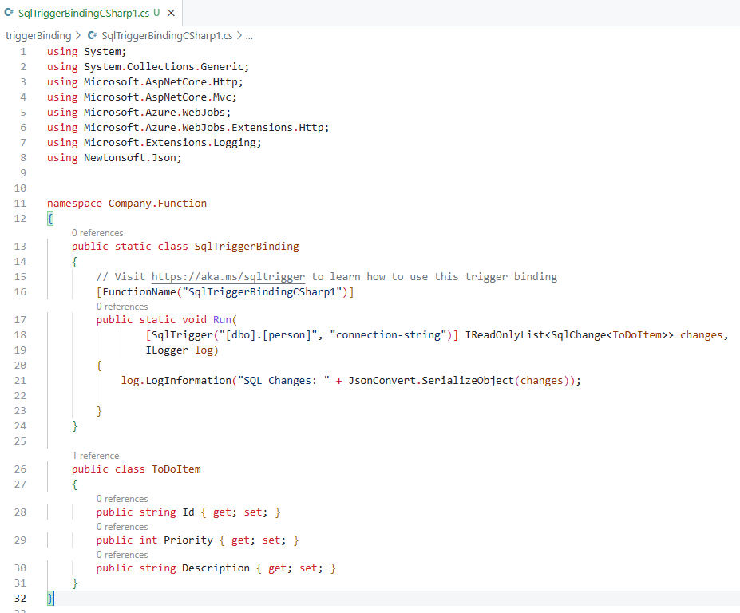

# Azure SQL bindings for Azure Functions

In this section, you will create a change data stream using Change Tracking, the Azure SQL Database, and the Azure SQL bindings for Azure Functions. The trigger will fire when an insert, update or delete is done on a table in the database. Once that change happens, the SQL binding will pick up the row and pass it to our Azure Function. In this lab, it will just display the row to the console log, but you can see how other Azure services like Event Hub, Blob storage, or Stream Processing can be used for event-based architecture application development.

## SQL Bindings workshop tasks

### Enable change tracking

1. In the SQL Server extension, right click on the Local Database connection profile and select New Query.

1. The person table needs change tracking enabled for the SQL bindings trigger to work correctly.
    The first command to be run will enable change tracking in the database.

    ```SQL
    ALTER DATABASE [devDB]
    SET CHANGE_TRACKING = ON;
    GO
    ```

    then enable change tracking on the person table:

    ```SQL
    ALTER TABLE [dbo].[person] ENABLE CHANGE_TRACKING;
    GO
    ```

### Create an Azure Function

1. Back in the terminal at the bottom of the page,

      

    issue the following command to change the directory back to the top level of this project:

    ```bash
    cd /workspaces/azure-sql-db-developers-workshop
    ```

1. Next, issue the following command to start the function creation process:

    ```bash
    func init
    ```

func init triggerBinding --worker-runtime dotnet

    Upon issuing that command, you will be presented with a choice of frameworks for this function to use.

    PICTURE HERE

    The framework/runtime for this project is dotnet so enter 1, then press enter.

    PICTURE HERE

    The next option is to choose a language.

    PICTURE HERE

    C# is used for this project so again, enter 1, then press enter.

    PICTURE HERE

1. When this process is finished, click the File Explorer extension to see the new files that were created for you.

          

### Adding libraries to the project

1. Next, we need to add some package references to the project (for SQL Bindings and Azure Event Hub). The following commands will add these references to the azure-sql-db-developers-workshop.csproj file.

    Run the following commands in the terminal:

    cd triggerBinding

    ```bash
    dotnet add package Microsoft.Azure.WebJobs.Extensions.Sql --prerelease
    ```

    ```bash
    dotnet add package Azure.Messaging.EventHubs
    ```

    ```bash
    dotnet add package Microsoft.Azure.WebJobs.Extensions.EventHubs
    ```
### Create the person class object

1. We are going to create a person class object file. To create a new file in codespaces, right click below the files in the file explorer extension and select New File.

      

1. Name this file Person.cs and press enter.

      

1. If the new file has not opened up for you in codespaces, select this file by right clicking on it. Copy and paste the following code into the Person.cs file to create the person class object.

    ```C#
    namespace Person.Function;
    public class person
    {
        public int person_id { get; set; }
        public string person_name { get; set; }
        public string person_email { get; set; }
        public string pet_preference { get; set; }
    }
    ```

and SAVE the file.

### Create the SQL trigger function

1. The next step is to create an Azure Function. Start by pressing F1 or Shift-Ctrl-P to bring up the command palette.

      

1. Enter “create function” into the text field and then select Azure Functions: Create Function.

      

1. A dialog box will appear in the center of the screen asking to “Initialize project for use with VS Code?”. Click Yes in the dialog box.

      

1. In the following dialog box, Select “HTTP Trigger” as the function template.

      

1. Now, on step 2, name the Function changeDataStreams in the next dialog box, and then press Enter.

      

1. Step 3 is for the function namespace. Accept the default namespace of Person.Function, and then press Enter.

      

1. In step four, select “Anonymous” for AccessRights.

      

1. Looking at the file explorer, there will be a new file called changeDataStream.cs which should also automatically open up in codespace for you.

      

### Adding the SQL Bindings code

1. If the file is not already open, open the file by right clicking on it. Replace the code in the file with the following:

    ```C#
    using System.Collections.Generic;
    using Microsoft.Azure.WebJobs;
    using Microsoft.Extensions.Logging;
    using Microsoft.Azure.WebJobs.Extensions.Sql;
    using System.Threading.Tasks;
    using System.Text.Json;
    namespace Person.Function;
    public static class streamPeople
    {
        [FunctionName("changeDataStream")]
        public static async Task RunAsync(
            [SqlTrigger("[dbo].[person]", "SqlConnectionString")]
                IReadOnlyList<SqlChange<Person>> changes,
            ILogger logger)
       {
          foreach (SqlChange<Person> change in changes)
          {
              var person = JsonSerializer.Serialize(change.Item);
              var message = $"{change.Operation} {person}";
              logger.LogInformation(message);
            }
        }
    }
    ```

    and SAVE the file.

    This code uses the SQL trigger binding to watch the cuperson stomer table for changes. When it sees a change, it will fire and capture each change. Here, in this code, we are just logging the data change to the terminal.

1. Now that the function code is done, we need to provide it a value for SqlConnectionString. This variable can be placed in the local.settings.json file and contain the connect string for our locally running database.

    Open the local.settings.json file 

      

    and add the following line just below the “Values”: { section:

    ```JSON
    "SqlConnectionString": "Server=localhost,1433;Database=devDB;User ID=vscode;Password=XXXXX;Encrypt=True;TrustServerCertificate=True;Connection Timeout=30;",
    ```

      

    and be sure to replace the XXXXX with the password of the database that was created before. If you forgot the password, run the following in the terminal to find it again:

    ```bash
    sqlcmd config connection-strings
    ```

    And remember to SAVE the file when done.

### Testing the trigger

1. At the terminal run the following command to start the Azure Function:

    ```bash
    func host start
    ```

      

    and once the function is started, open a new query sheet for the Local Database.

      

1. Issue the following SQL insert statement:

    ```SQL
    insert into dbo.person values(N'Ellie', N'ellie@contoso.com', N'Cats');
    ```

    You should see the following in the terminal window indicating the trigger binding did see the change:

    ```bash
    [2023-07-11T19:18:03.124Z] Executing 'changeDataStream' (Reason='New change detected on table '[dbo].[person]' at 2023-05-11T19:18:03.0902305Z.', Id=541ff09e-54ac-48e8-8d17-bbcc9a451432)
    [2023-07-11T19:18:03.176Z] Insert{"person_id":6,"person_name":"Ellie","person_email":"ellie@contoso.com","pet_preference":"Cats"}
    [2023-07-11T19:18:03.195Z] Executed 'changeDataStream' (Succeeded, Id=541ff09e-54ac-48e8-8d17-bbcc9a451432, Duration=93ms)
    ```
